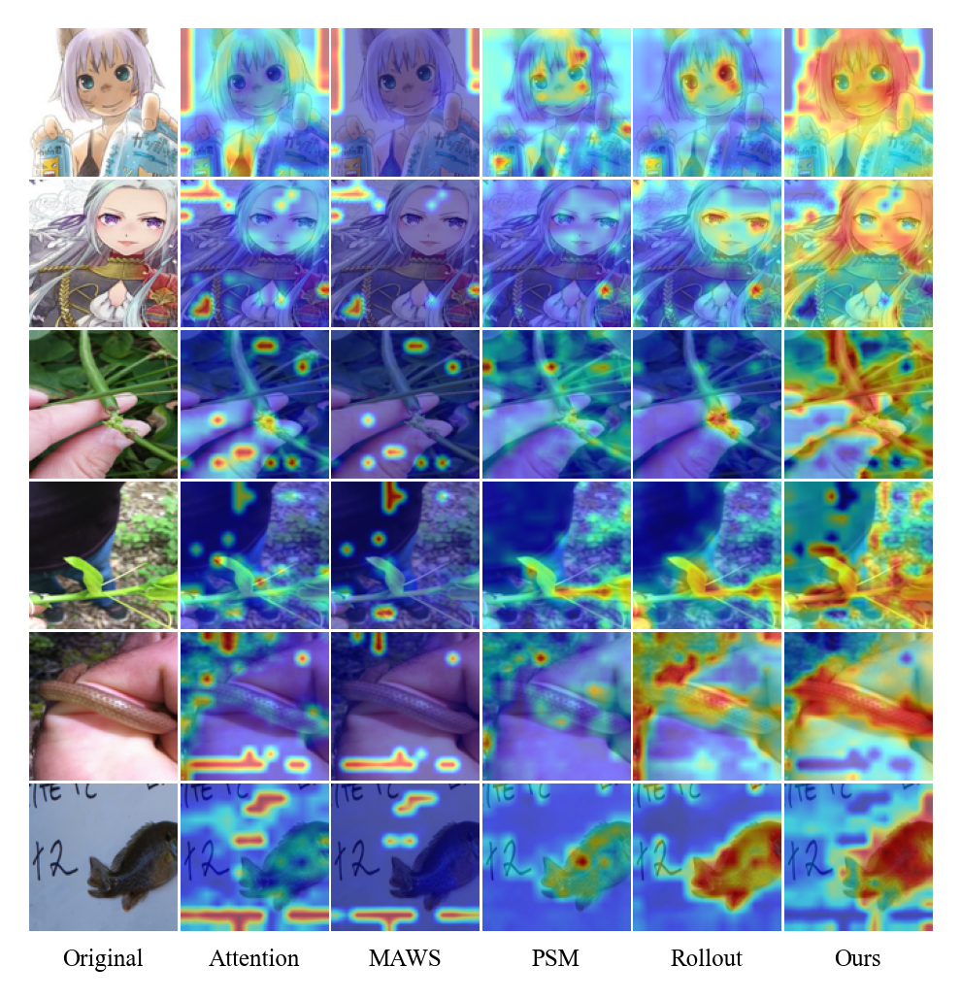
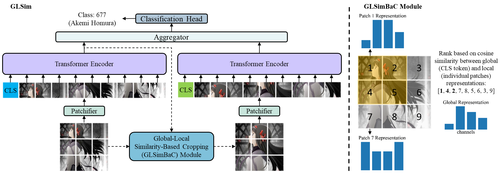
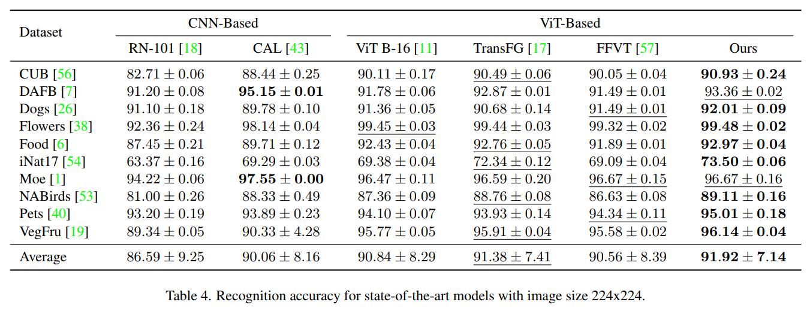
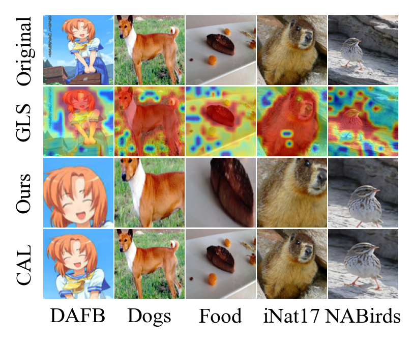
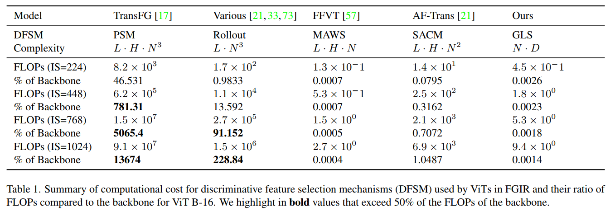
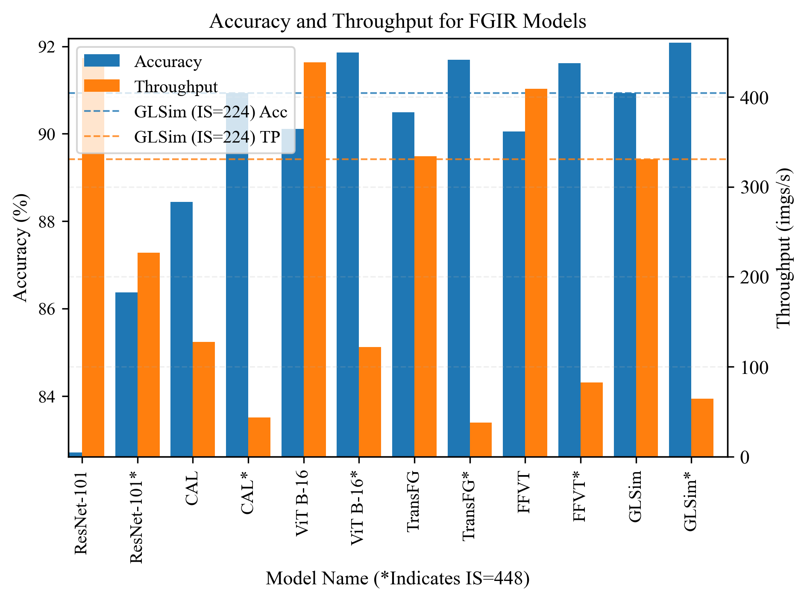
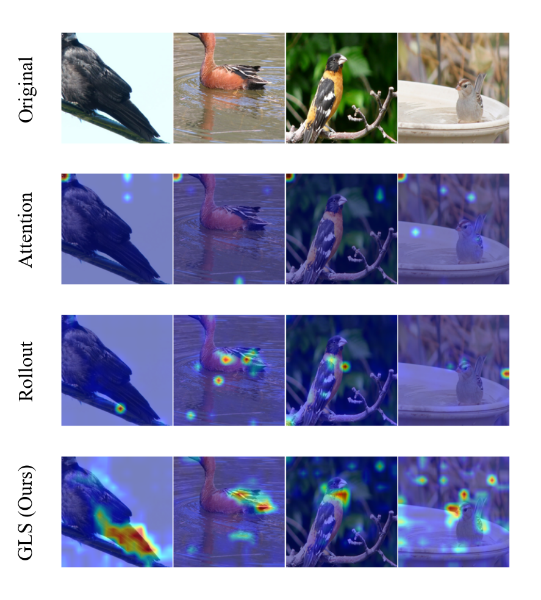

# Global-Local Similarity for Efficient Fine-Grained Image Recognition with Vision Transformers

We propose a novel metric, GLS, to identify discriminative regions in an image
by comparing the similarity between its global and local representations.



Based on these regions we crop the image, encode it, followed by collective refining
of high-level features using an aggregator module for robust predictions.



Our method obtains favorable results in terms of accuracy in a variety of 
fine-grained tasks(aircraft, cars, variety of plants, birds, other animals
asides from birds, anime characters, and food).



Samples of our crops are shown below:



Our proposed discriminative feature selection mechanism
achieves these results at several order of magnitudes lower computational cost
compared to aggregated attention mechanisms such as attention rollout.



Also, our method achieves a superior accuracy vs cost trade-off compared to alternatives.



Pre-trained checkpoints are available on [HuggingFace](https://huggingface.co/NYCU-PCSxNTHU-MIS/GLSim)!

Try it on [Colab!](https://colab.research.google.com/drive/1Jt9bLqHyyqTGARQjBJ2-Ge0IYXIYk7yE?usp=sharing)

The code for our model (and the ViT backbone) is in `glsim/model_utils/glsim.py`.

Pseudo-code for the whole process:
```
def forward(images):
    feats = encoder(images)
    crops = glscm(feats, images)
    feats_c = encoder(crops)
    x = torch.cat([feats[:, :1, :], feats_c[:, :1, :]], dim=1)
    x = aggregator(x)
    preds = head(x)
    return preds

def glscm(feats, images, patch_size=16):
    # global (CLS token, first one) and local representations (other patches)
    g = feats[:, :1, :]
    l = feats[:, 1:, :]

    # cosine similarity between global-local and rank based on highest similarity
    sim = cosine_sim(g, l, dim=-1)
    dist, ind = sim.topk(top_o, dim=-1, largest=True)

    # converts indexes from 1d sequence to 2d sequence
    ind_x = torch.div(ind, int(math.sqrt(l.shape[1])), rounding_mode='floor')
    ind_y = ind % int(math.sqrt(l.shape[1]))

    # 2d indexes corresponding to most left, right, top and bottom of the image
    ind_x_i = reduce(ind_x, 'b a -> b', 'min')
    ind_x_f = reduce(ind_x, 'b a -> b', 'max')
    ind_y_i = reduce(ind_y, 'b a -> b', 'min')
    ind_y_f = reduce(ind_y, 'b a -> b', 'max')

    # converts 2d indexes to coordinates by multiplying times patch size
    x_i = ind_x_i * patch_size
    y_i = ind_y_i * patch_size
    x_f = ind_x_f * patch_size
    y_f = ind_y_f * patch_size

    # crops image based on 2d coordinates then resizes
    images_crops = []
    for i in range(ind.shape[0]):
        x_0 = max(x_i[i], 0)
        y_0 = max(y_i[i], 0)
        x_1 = min(max(x_f[i], x_i[i] + patch_size), images.shape[-1])
        y_1 = min(max(y_f[i], y_i[i] + patch_size), images.shape[-1])

        crop = images[i:i+1, :, x_0:x_1, y_0:y_1]
        crop = F.upsample_bilinear(crop, size=(images.shape[-1], images.shape[-1]))
        images_crops.append(crop)

    images_crops = torch.cat(images_crops, dim=0)
    return images_crops
```

## Setup

```
pip install -e . 
```

## Preparation

All of these require to first `chmod +x script_name` the corresponding scripts.

To download pretrained checkpoints for CUB, DAFB, iNat17, NABirds (and vanilla In-21k ckpts):
```
./scripts/download_ckpts.sh
python tools/preprocess/download_convert_vit_models.py
```

To download datasets:
```
./scripts/download.sh
```

To prepare the train and validation splits from the train_val set for each dataset (otherwise can skip this step and just copy the ones we included in the `data` directory to each respective dataset directory in order to ensure the splits are the same as ours):
```
./prepare_datasets.sh
```

Dataset stats:
```
./scripts/calc_hw.sh
```

## Train

To train a `GLSim-ViT B-16` with CLS classifier on CUB using image size 224:
```
python tools/train.py --cfg configs/cub_ft_is224_medaugs.yaml --lr 0.01 --model_name vit_b16 --cfg_method configs/methods/glsim.yaml
```

Similarly, for image size 448:
```
python tools/train.py --cfg configs/cub_ft_is224_medaugs.yaml --lr 0.01 --model_name vit_b16 --cfg_method configs/methods/glsim.yaml --cfg_is configs/settings/ft_is448.yaml
```

## Evaluation

To evaluate a particular checkpoint on the test set (logs results to W&B):

```
python tools/train.py --ckpt_path ckpts/cub_glsim_224.pth --test_only
```

To enforce batch size 1 (emulates streaming / on-demand classification behavior):
```
python tools/train.py --ckpt_path ckpts/cub_glsim_224.pth --batch_size 1
```

To visulize misclassification for a particular network on the test set:

```
python tools/train.py --ckpt_path ckpts/cub_glsim_224.pth --vis_errors
```

To save these results (results are saved in the same folder as train folder) (*note: takes some time):

```
python tools/train.py --ckpt_path ckpts/cub_glsim_224.pth --vis_errors_save
```

## Inference

Inference on a single image (saves results of original and crop side by side on `results_inference/`):
```
python tools/inference.py --ckpt_path ckpts/dafb_glsim.pth --images_path samples/others/dafb_rena_170785.jpg
```

To visualize the global-local similarity (and other fine-grained discriminative
feature selection mechanisms such as attention rollout as shown in the
first figure and the following figure):



For batched inference on random train or test splits:

```
python tools/vis_dfsm.py --serial 52 --batch_size 4 --vis_cols 4 --cfg configs/nabirds_ft_is224_weakaugs.yaml --model_name glsvit_base_patch14_dinov2.lvd142m --vis_mask gls --vis_mask_pow
python tools/vis_dfsm.py --serial 52 --batch_size 4 --vis_cols 4 --cfg configs/nabirds_ft_is224_weakaugs.yaml --model_name glsvit_base_patch14_dinov2.lvd142m --vis_mask attention_11
python tools/vis_dfsm.py --serial 52 --batch_size 4 --vis_cols 4 --cfg configs/nabirds_ft_is224_weakaugs.yaml --model_name glsvit_base_patch14_dinov2.lvd142m --vis_mask rollout_0_4
```

For individual inference:
```
python tools/inference.py --ckpt_path ckpts/dafb_glsim.pth --images_path samples/others/dafb_rena_170785.jpg --vis_mask_sq --vis_mask glsim_norm
python tools/inference.py --ckpt_path ckpts/dafb_glsim.pth --images_path samples/others/dafb_rena_170785.jpg --vis_mask rollout
```

For doing inference on a whole folder (and its subdirectories):
```
python tools/inference.py --ckpt_path ckpts/cub_glsim_224.pth --images_path samples/
```

## Usage as a module
```
import torch
from glsim.model_utils import ViTGLSim, ViTConfig

model_name = 'vit_b16'
cfg = ViTConfig(model_name, debugging=True, classifier='cls', dynamic_anchor=True,
    reducer='cls', aggregator=True, aggregator_norm=True, aggregator_num_hidden_layers=1)
model = ViTGLSim(cfg)

x = torch.rand(2, cfg.num_channels, cfg.image_size, cfg.image_size)
out = model(x)
```
